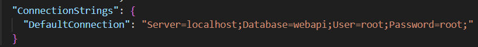
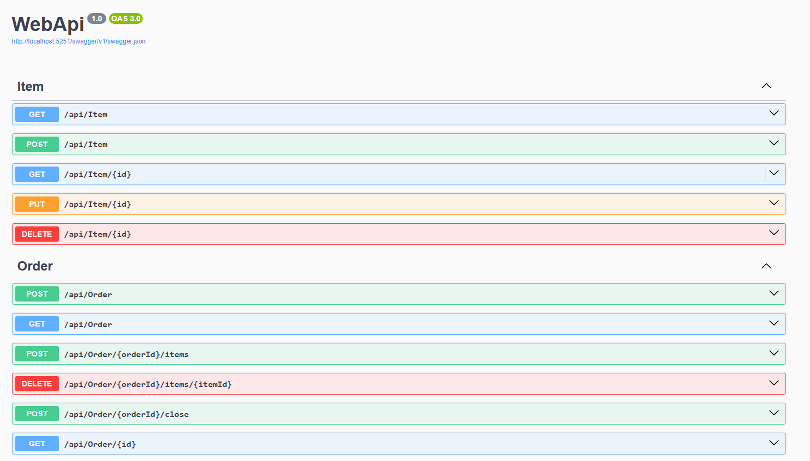
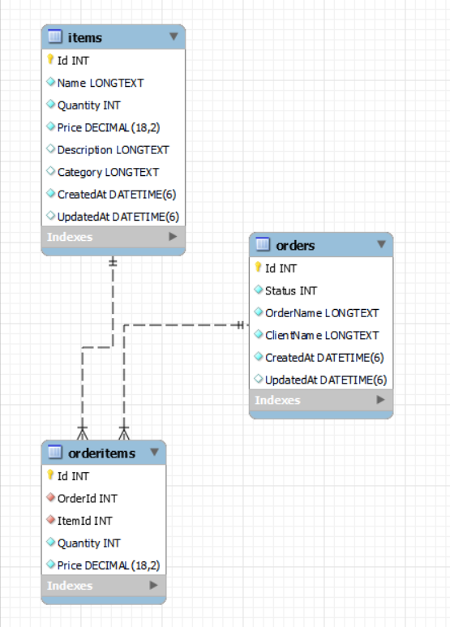

# WebApi
Web-Api para gestão de Pedidos.

## Índice

- [Sobre](#sobre)
- [Funcionalidades](#funcionalidades)
- [Tecnologias Utilizadas](#tecnologias-utilizadas)
- [Como Começar](#como-começar)
  - [Pré-requisitos](#pré-requisitos)
  - [Instalação](#instalação)
- [Endpoints](#endpoints)
- [Modelo banco](#modelo-banco)

## Sobre
API desenvolvida com finalidade de gestão de pedidos e produtos.

## Funcionalidades

- Criar pedidos
- Listar pedidos
- Adicionar/remover produtos de um pedido
- Fechar pedidos
- Listar produtos disponíveis

## Tecnologias Utilizadas
- **.NET 8.0:** Framework utilizado para desenvolvimento da API. 
- **Entity Framework Core:** ORM para interação com o banco de dados.
Conexão com o Banco de dados pode ser ajustado em appsettings.json.
- **MySQL:** Banco de dados utilizado para armazenamento de dados.
- **IDE para desenvolvimento:** VSCode e Visual Studio.
- **Documentação da API:** Swagger.
- **xUnit** Para testes Unitários.

## Como Começar

### Pré-requisitos

Antes de começar, você precisará ter as seguintes ferramentas instaladas:

- [.NET SDK 8](https://dotnet.microsoft.com/download/dotnet/8.0)

### Instalação

1. Clone o repositório:

   ```bash
   git clone https://github.com/LuizPagliari/WebApi.git

2. Navegue até o diretório do projeto:

    cd WebApi

3. Restaure as dependências:

dotnet restore

4. Configure o banco de dados em appsettings.json:



5. Rodar a aplicação:

dotnet run

No navegador acesse http://localhost:5251/swagger/index.html

Ou rodando manualmente o Startup.cs que está localizado na pasta API.

## EndPoints



## Modelo banco


